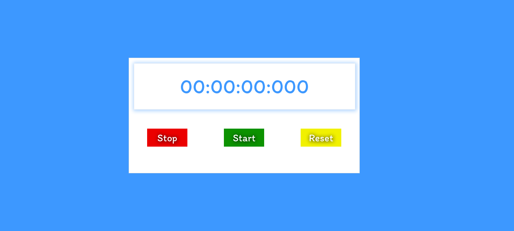
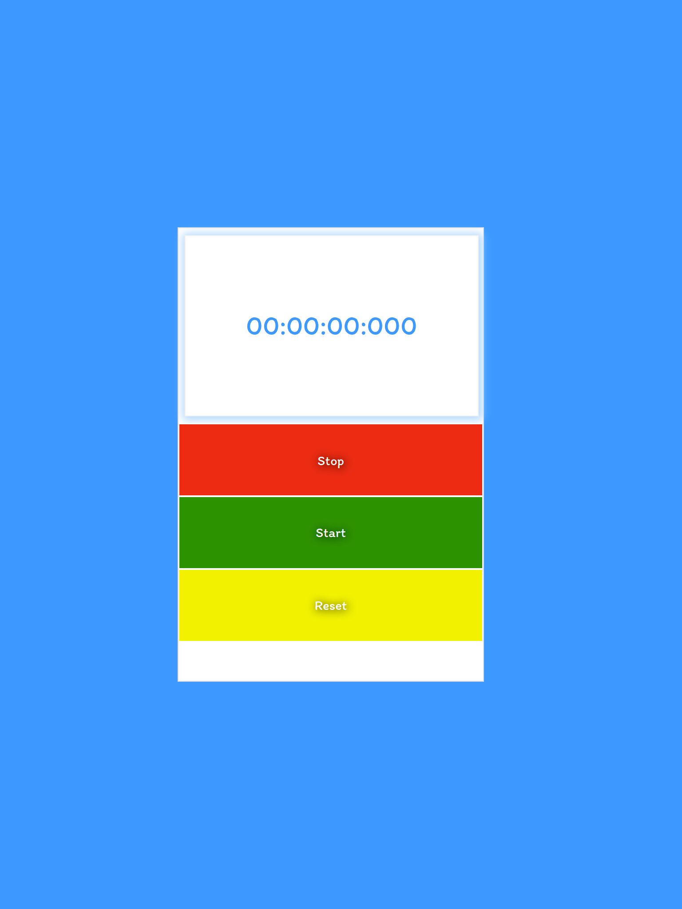

# JavaScript Stop Timer
## Table of contents

- [OverView](#):
  - This project was challnge of how should make timer with JavaScript and how 
  should i work with setInterval() function in my project.

### Screenshot

<h1>Monitor View</h1>

<h1>Mobile View</h1>

## My process

### Built with

- Html5
- CSS
- Flexbox
- CSS Grid
- Mobile-first workflow
- Bootstrap5
- JavaScript

### What I learned

How should I use setInterval() function and how should I match time with it.

### Useful resources

- [Example resource 1](https://www.w3schools.com) - w3schools had a lot of document and content to how work with Html, Css, Bootstrap5 and JavaScript.
- [Example resource 2](https://www.youtube.com) - Also in youtube you can find a lot of content about how make Stop Timer.

## Author
- Mohammad Reza Dargi